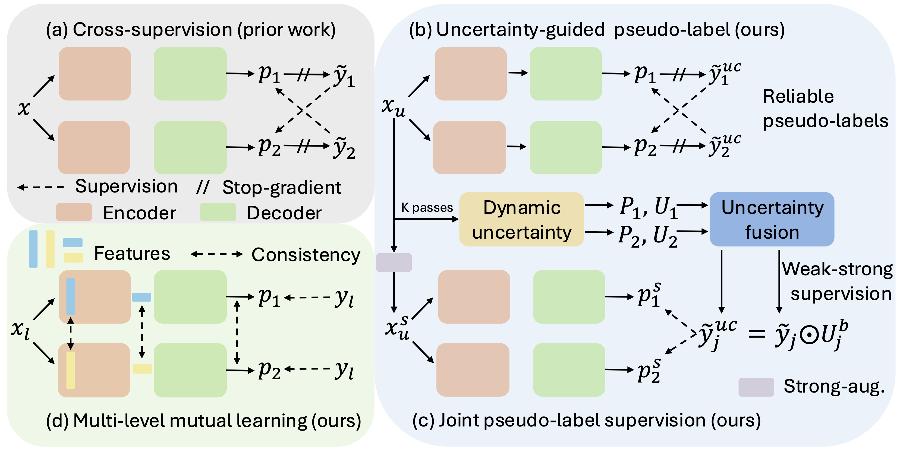

# Endo-SemiS
Endo-SemiS: Towards Robust Semi-supervised Image Segmentation for Endoscopic Video

This work has been submitted to MIDL2026

##
Our work can be summarized as follows: \
(a) We use a cross-supervision framework to avoid biased learning from a single network. \
(b) We use uncertainty to improve the quality of each network’s pseudo-labels. \
(c) When one network’s prediction has a large defect with high confidence values, we fuse a joint pseudo-label by selecting the most confident regions from both network and use this pseudo-label to supervise them. \
(d) We use multi-level mutual learning to further mitigate confirmation bias and improve consistency between networks, producing more reliable pseudo-labels.



The details of our methods and results can be viewed in the paper.

## Usage

**Installation**
```
conda create -n endosemis python=3.9
conda activate endosemis
pip install -r requirements.txt # or conda env create -f environment.yml
```

**Train kidney dataset**

```
python train.py --name <your running name> --json_path <your json file path> --height 256 --width 256
```
The code will automatically create a folder to store logs under /src/checkpoints/your running name/

**Test kidney dataset**

```
python test.py --name your running name --input <your test image folder> --label <your test label folder> --height 256 --width 256
```
use --save to save the predictions


**Train polyp dataset**

```
python train_semi_polygen.py --name <your running name> --json_path <your json file path>
```

**Test polyp dataset**

```
python test_semi_polygen.py --name <your running name> --json_path <your json file path>
```

same augments will be used for **train_semi_polygen.py** and **test_sup_polygen.py**


## Pretrained models
| kidney Endo-SemiS | polyp Endo-SemiS | polyp full sup | polyp semi10 sup |
|------------------------------|------------------------------|------------------------------|------------------------------|
| Internal, currently (contact me) |[Download](https://drive.google.com/drive/u/1/folders/1yW8wm1IKgKUbqxoCRjtfC4uKsuVGJdif)| [Download](https://drive.google.com/drive/u/1/folders/1HyaMSjIDLcjZXCS8qz6FMO7TFTdd1N7e) |[Download](https://drive.google.com/drive/u/1/folders/1Qs0m1GiR_KwFvjOce8R48dmxAD5kbcgY)|

Test and training logs are attached to these links.


## Qualitative results of kidney dataset
The kidney stone laser lithotomy (surgery) exhibits large variation in image quality due to the complex in vivo environment during surgery. Here we show qualitative kidney stone results (10\% labeled data). Yellow circles highlight poor visibility areas. (a) fiberoptic frames, (b) digital frames, (c) fluid distortions,  (d) motion blur, (e) debris during stone ablation, and (f) illumination changes.


## Citing Endo-SemiS
If you find our Endo-SemiS helpful, please use the following BibTeX entry.

```
@inproceedings{li2024interactive,
  title={Endo-SemiS: Towards Robust Semi-Supervised Image Segmentation for Endoscopic Video,
  author={Li, Hao and Lu, Daiwei, Wang, Jiacheng and Kavoussi, Nicholas and Oguz, Ipek},
  booktitle={Medical Imaging in Deep Learning},
  year={2026 (submitted)}
}
```

## Acknowledgements
[SSL4MIS](https://github.com/HiLab-git/SSL4MIS)

